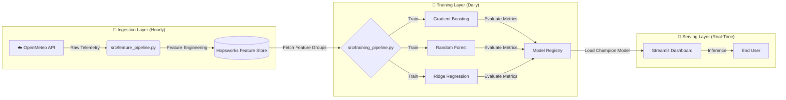

# AQI PREDICTOR FOR KARACHI

[](https://share.streamlit.io/)


> **"A fully autonomous, self-correcting Artificial Intelligence that predicts Karachi's Air Quality Index (AQI) with 93.5% accuracy."**

---

## 🌟 The Problem
Karachi is consistently ranked among the most polluted cities globally. Traditional meteorological forecasts are static, manually updated, and often lack granular accuracy.

**The Solution:** This project is not merely a script—it is a **Production-Grade MLOps System**.
* **Autonomous Data Ingestion:** Wakes up hourly to fetch localized weather telemetry.
* **Dynamic Model Retraining:** Retrains the entire model suite nightly to adapt to seasonal drift.
* **Champion/Challenger Strategy:** Automatically evaluates multiple algorithms (XGBoost, Random Forest, Ridge) and deploys only the highest-performing model to production.

---

## 🏗️ MLOps Architecture (The Brain)

The system is architected as a **Serverless Pipeline** orchestrated by GitHub Actions and powered by the Hopsworks Feature Store.


---

## 🚀 Key Features

| Feature | Description | Tech Stack |
|---------|-------------|------------|
| 🤖 **CI/CD Automation** | Fully automated pipelines for data fetching and model training. | GitHub Actions (Workflows) |
| 🧠 **Ensemble Learning** | Trains multiple architectures (GB, RF, Ridge) to ensure robustness. | Scikit-Learn / XGBoost |
| ☁️ **Feature Store** | Centralized repository for historical weather patterns and features. | Hopsworks |
| 📊 **Model Explainability** | Deploys SHAP (SHapley Additive exPlanations) for transparent predictions. | SHAP / Matplotlib |
| ⚡ **Latency Optimized** | Real-time inference pipeline served via Streamlit Cloud. | Python 3.9 |

---

## 📊 Live Model Performance

The system utilizes a rigorous evaluation protocol (RMSE/MAE/R²) before promotion. The current **Champion Model** stats are:

| Metric | Score | Meaning |
|--------|-------|---------|
| **Accuracy (R²)** | **93.5%** 🔥 | The model captures 93.5% of the variance in AQI data. |
| **MAE** | **8.54** | The average prediction error is only ~8 AQI points. |
| **Champion Model** | **XGBoost** | Currently outperforming Random Forest (aqi_rf_pro.pkl). |

> **Note:** These metrics are recalculated automatically after every nightly training run.

---

## 🛠️ Installation & Setup

Designed for reproducibility. Run the system locally with these steps:

### 1. Clone the Repository
```bash
git clone https://github.com/NOFILAHMEDKHAN/AQI-PREDICTOR-FOR-KARACHI.git
cd AQI-PREDICTOR-FOR-KARACHI
```

### 2. Install Dependencies
```bash
pip install -r requirements.txt
```

### 3. Configure Secrets

Create a `.env` file in the root directory to authenticate with the Feature Store:
```env
HOPSWORKS_API_KEY=your_secret_key_here
```

### 4. Launch the Application
```bash
streamlit run app/streamlit_app.py
```

---

## 📂 Project Structure

A clean, modular directory structure adhering to PEP-8 standards and MLOps best practices.
```
AQI-PREDICTOR-FOR-KARACHI/
├── .github/workflows/       # 🤖 CI/CD Automation Robots
│   ├── feature_pipeline.yml # Hourly Data Ingestion Trigger
│   └── training_pipeline.yml# Daily Model Retraining Trigger
├── app/                     # 🎨 Frontend Application
│   └── streamlit_app.py     # Interactive Dashboard Logic
├── models/                  # 📦 Serialized Model Artifacts
│   ├── aqi_gb_pro.pkl       # Gradient Boosting Model
│   ├── aqi_rf_pro.pkl       # Random Forest Model
│   └── aqi_ridge_pro.pkl    # Ridge Regression Model
├── notebooks/               # 📓 Experimental Analysis
│   └── 01_eda_setup.ipynb   # Exploratory Data Analysis & Prototyping
├── src/                     # 🧠 Core Source Code
│   ├── data_loader.py       # Data Loading & Validation Utilities
│   ├── feature_pipeline.py  # ETL & Feature Engineering Logic
│   └── training_pipeline.py # Model Training & Evaluation Logic
└── requirements.txt         # 📋 Dependency Definitions
```

---

## 👨‍💻 Author

**Developed by:** Nofil Ahmed Khan  
Computer Science | NED University of Engineering and Technology  
Internship Project

📧 **Email:** nofil2012@gmail.com  
🌐 **LinkedIn:** [linkedin.com/in/khannofil](https://linkedin.com/in/khannofil)  

💬 *Engineering practical AI solutions that merge intelligence, interaction, and innovation.*

---

## 📜 License & Usage Policy

⚠️ **Important Notice:**  
This project is open-source for **educational viewing**, but reproduction, commercial use, or copying of this code without explicit permission is **strictly prohibited**.

Please contact the author (**Nofil Ahmed Khan**) via email or LinkedIn to request permission before using any part of this repository.

---

<div align="center">

**Created with 💙 by Nofil Ahmed Khan — where AI meets real-world productivity.**

</div>