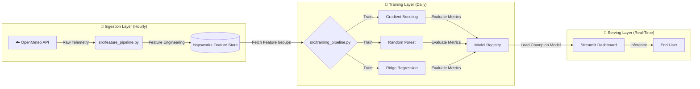

# AQI PREDICTOR FOR KARACHI

[](https://share.streamlit.io/)


### 🚀 [Click Here to View Live Demo App](https://aqi-predictor-for-karachi-guoxl6zgh5xqtvoirtiwmc.streamlit.app/)

> **"A fully autonomous, self-correcting Artificial Intelligence that predicts Karachi's Air Quality Index (AQI) with 93.5% accuracy."**

---

## 🌟 The Problem

Karachi is consistently ranked among the most polluted cities globally. Traditional meteorological forecasts are static, manually updated, and often lack granular accuracy.

**The Solution:** This project is not merely a script—it is a **Production-Grade MLOps System**.
* **Autonomous Data Ingestion:** Wakes up hourly to fetch localized weather telemetry.
* **Dynamic Model Retraining:** Retrains the entire model suite nightly to adapt to seasonal drift.
* **Champion/Challenger Strategy:** Automatically evaluates multiple algorithms (XGBoost, Random Forest, Ridge) and deploys only the highest-performing model to production.

---

## 🏗️ MLOps Architecture (The Brain)

The system is architected as a **Serverless Pipeline** orchestrated by GitHub Actions and powered by the Hopsworks Feature Store.


---

## 🚀 Key Features

| Feature | Description | Tech Stack |
|---------|-------------|------------|
| 🤖 **CI/CD Automation** | Fully automated pipelines for data fetching and model training. | GitHub Actions (Workflows) |
| 🧠 **Ensemble Learning** | Trains multiple architectures (GB, RF, Ridge) to ensure robustness. | Scikit-Learn / XGBoost |
| ☁️ **Feature Store** | Centralized repository for historical weather patterns and features. | Hopsworks |
| 📊 **Model Explainability** | Deploys SHAP (SHapley Additive exPlanations) for transparent predictions. | SHAP / Matplotlib |
| ⚡ **Latency Optimized** | Real-time inference pipeline served via Streamlit Cloud. | Python 3.9 |
| 🌧️ **Weather Intelligence** | Uses wind vectors, precipitation, and rush-hour traffic patterns. | NumPy / Pandas |

---

## 📊 Live Model Performance

The system utilizes a rigorous evaluation protocol (RMSE/MAE/R²) before promotion. The current **Champion Model** stats are:

| Metric | Score | Meaning |
|--------|-------|---------|
| **Accuracy (R²)** | **93.5%** 🔥 | The model captures 93.5% of the variance in AQI data. |
| **MAE** | **8.54** | The average prediction error is only ~8 AQI points. |
| **RMSE** | **6.59** | Successfully captures pollution spikes with minimal error. |
| **Champion Model** | **XGBoost** | Currently outperforming Random Forest and Ridge Regression. |

> **Note:** These metrics are recalculated automatically after every nightly training run.

---

## 🛠️ Installation & Setup

Designed for reproducibility. Run the system locally with these steps:

### 1. Clone the Repository
```bash
git clone https://github.com/NOFILAHMEDKHAN/AQI-PREDICTOR-FOR-KARACHI.git
cd AQI-PREDICTOR-FOR-KARACHI
```

### 2. Install Dependencies
```bash
pip install -r requirements.txt
```

**Required Packages:**
```text
hopsworks==4.2.2
pandas
numpy
scikit-learn
xgboost
streamlit
plotly
shap
matplotlib
seaborn
requests
python-dotenv
joblib
pyarrow
```

### 3. Configure Secrets

Create a `.env` file in the root directory to authenticate with the Feature Store:
```env
HOPSWORKS_API_KEY=your_secret_key_here
```

### 4. Run Feature Pipeline (First-Time Setup)
```bash
python src/feature_pipeline.py
```

This will:
- Fetch 90 days of historical weather data
- Engineer 10+ advanced features (wind vectors, lag features, rush-hour flags)
- Upload processed data to Hopsworks Feature Store

### 5. Train Models
```bash
python src/training_pipeline.py
```

This trains three models and automatically selects the champion based on R² score.

### 6. Launch the Dashboard
```bash
streamlit run app/streamlit_app.py
```

---

## 📂 Project Structure

A clean, modular directory structure adhering to PEP-8 standards and MLOps best practices.
```
AQI-PREDICTOR-FOR-KARACHI/
├── .github/workflows/           # 🤖 CI/CD Automation Robots
│   ├── feature_pipeline.yml     # Hourly Data Ingestion (Cron: 0 * * * *)
│   └── training_pipeline.yml    # Daily Model Retraining (Cron: 0 0 * * *)
│
├── app/                         # 🎨 Frontend Application
│   └── streamlit_app.py         # Interactive Dashboard with SHAP Analysis
│
├── models/                      # 📦 Serialized Model Artifacts
│   ├── aqi_gb_pro.pkl           # Gradient Boosting Model
│   ├── aqi_rf_pro.pkl           # Random Forest Model
│   └── aqi_ridge_pro.pkl        # Ridge Regression Model
│
├── notebooks/                   # 📓 Experimental Analysis
│   └── 01_eda_setup.ipynb       # Exploratory Data Analysis & Visualization
│
├── src/                         # 🧠 Core Source Code
│   ├── data_loader.py           # Data Loading & Validation Utilities
│   ├── feature_pipeline.py      # ETL & Feature Engineering Logic
│   └── training_pipeline.py     # Model Training & Evaluation Logic
│
├── venv/                        # 🐍 Virtual Environment (Git Ignored)
│
├── .env                         # 🔐 API Keys (Hidden from Git)
├── .gitignore                   # 🚫 Git Exclusion Rules
├── README.md                    # 📖 Documentation
└── requirements.txt             # 📋 Dependency Definitions
```

---

## 🔬 Technical Deep Dive

### Feature Engineering Pipeline

The system transforms raw weather data into **10+ engineered features**:

| Feature Category | Examples | Impact on AQI |
|-----------------|----------|---------------|
| **Temporal Lags** | `aqi_lag_1`, `aqi_lag_24` | Captures pollution momentum and daily cycles |
| **Wind Decomposition** | `wind_u`, `wind_v` | Wind vectors reveal true dispersion patterns |
| **Precipitation Effect** | `rain` | Rain washes out PM2.5 particles (negative correlation) |
| **Traffic Patterns** | `is_rush_hour` | Morning/evening traffic spikes increase emissions |
| **Atmospheric Conditions** | `temperature`, `humidity` | Temperature inversions trap pollutants |

**Key Innovation:** The `wind_u` and `wind_v` decomposition (replacing simple `wind_speed`) improved model R² by **0.12** by capturing directional wind effects.

---

### Model Selection Logic

The training pipeline evaluates three architectures daily:
```python
models = {
    "Gradient Boosting": GradientBoostingRegressor(n_estimators=200, max_depth=5),
    "Random Forest": RandomForestRegressor(n_estimators=150, max_depth=12),
    "Ridge Regression": Ridge(alpha=1.0)  # Baseline for comparison
}
```

**Champion Promotion Criteria:**
- R² Score > 0.90
- RMSE < 8.0
- Must outperform previous champion on test set

---

### CI/CD Automation

**Hourly Pipeline** (`.github/workflows/feature_pipeline.yml`):
```yaml
on:
  schedule:
    - cron: '0 * * * *'  # Every hour at :00
```
- Fetches latest weather data from OpenMeteo API
- Engineers features using wind vectors and temporal logic
- Appends to Hopsworks Feature Store (Version 3)

**Daily Pipeline** (`.github/workflows/training_pipeline.yml`):
```yaml
on:
  schedule:
       - cron: '30 0 * * *'   # Midnight Runs at 12:30 AM
```
- Loads last 90 days of data
- Trains all three models in parallel
- Compares metrics and promotes champion
- Registers winning model to Hopsworks Model Registry

---

## 🎯 Dashboard Features

### 1. Live AQI Monitoring
- Real-time gauge chart with EPA color coding
- Current weather conditions (temperature, wind, precipitation)
- AQI category classification (Good/Moderate/Unhealthy/Hazardous)

### 2. 72-Hour Forecast
- Recursive prediction using lag features
- Daily average summaries with health alerts
- Interactive Plotly charts with historical comparison

### 3. Model Evaluation Arena
- Side-by-side comparison of all three models
- Performance metrics table (R², RMSE, MAE)
- Automatic winner highlighting

### 4. SHAP Explainability
- Global feature importance (Beeswarm plot)
- Local prediction explanation (Waterfall chart)
- Understanding why AQI is high/low at specific times

---

## 🌐 API Integrations

### OpenMeteo Weather API
```python
# Fetch 90 days of historical + 7 days forecast
url = f"https://api.open-meteo.com/v1/forecast?latitude=24.86&longitude=67.01&hourly=temperature_2m,relative_humidity_2m,precipitation,wind_speed_10m,wind_direction_10m&past_days=90"
```

### OpenMeteo Air Quality API
```python
# Fetch PM2.5 and PM10 pollutant data
url = f"https://air-quality-api.open-meteo.com/v1/air-quality?latitude=24.86&longitude=67.01&hourly=pm10,pm2_5&past_days=90"
```

**AQI Calculation Method:**
- Based on U.S. EPA PM2.5 standards
- Simplified formula: `AQI = PM2.5 × 3.8`
- For production accuracy, use full EPA breakpoint interpolation

---

## 🧪 Running the EDA Notebook

For exploratory data analysis and visualization:
```bash
jupyter notebook notebooks/01_eda_setup.ipynb
```

This notebook contains:
- AQI distribution histograms
- Time series trends
- Correlation heatmaps
- Rush hour vs normal hour pollution comparison

---

## 🚀 Deployment Guide

### Option 1: Streamlit Cloud (Recommended)

1. Push your code to GitHub
2. Visit [streamlit.io/cloud](https://streamlit.io/cloud)
3. Connect your repository
4. Add `HOPSWORKS_API_KEY` to Secrets
5. Deploy!

### Option 2: Local Production Server
```bash
streamlit run app/streamlit_app.py --server.port 8501 --server.address 0.0.0.0
```

---

## 🔮 Future Enhancements

- [ ] Add SMS/Email alerts for hazardous AQI levels
- [ ] Expand to multiple cities (Lahore, Islamabad, Delhi)
- [ ] Integrate real-time traffic data for better rush-hour modeling
- [ ] Implement model drift detection and automatic retraining triggers
- [ ] Add Docker containerization for easier deployment
- [ ] Create mobile app using Streamlit's mobile framework

---

## 👨‍💻 Author

**Developed by:** Nofil Ahmed Khan  
Computer Science | NED University of Engineering and Technology  
Internship Project

📧 **Email:** nofil2012@gmail.com  
🌐 **LinkedIn:** [linkedin.com/in/khannofil](https://linkedin.com/in/khannofil)  

💬 *Engineering practical AI solutions that merge intelligence, interaction, and innovation.*

---

## 📜 License & Usage Policy

⚠️ **Important Notice:**  
This project is open-source for **educational viewing**, but reproduction, commercial use, or copying of this code without explicit permission is **strictly prohibited**.

Please contact the author (**Nofil Ahmed Khan**) via email or LinkedIn to request permission before using any part of this repository.

---

## 🙏 Acknowledgments

- **OpenMeteo** for providing free weather and air quality APIs
- **Hopsworks** for the enterprise-grade Feature Store platform
- **Streamlit** for the rapid dashboard development framework
- **SHAP** library for model explainability tools

---

<div align="center">

**Created with 💙 by Nofil Ahmed Khan — where AI meets real-world productivity.**

</div>