# AQI PREDICTOR FOR KARACHI

[](https://share.streamlit.io/)


> **"A fully autonomous, self-correcting Artificial Intelligence that predicts Karachi's Air Quality Index (AQI) with 93.5% accuracy."**

---

## 🌟 The Problem
Karachi is often ranked among the most polluted cities in the world. Traditional forecasts are static and often outdated. 

**The Solution:** This project is not just a static script. It is a **Living System**. 
* It wakes up every hour to fetch real-time data.
* It retrains its own brain every night to adapt to changing weather patterns.
* It deploys the best-performing model (XGBoost vs Random Forest) automatically without human intervention.

---

## 🏗️ MLOps Architecture (The Brain)

The system runs on a **Serverless MLOps Pipeline** powered by GitHub Actions and Hopsworks.

```mermaid
graph LR
    subgraph "🔄 Data Engineering (Hourly)"
        A[☁️ OpenMeteo API] -->|Fetch Weather| B(Feature Pipeline)
        B -->|Clean & Engineer| C[(Hopsworks Feature Store)]
    end
    
    subgraph "🧠 Model Training (Daily)"
        C -->|Load Historic Data| D{Training Pipeline}
        D -->|Train| E[XGBoost]
        D -->|Train| F[Random Forest]
        D -->|Train| G[Ridge Regression]
        E & F & G -->|Compare & Select Best| H[Model Registry]
    end
    
    subgraph "🚀 Deployment (Real-Time)"
        H -->|Serve Model| I[Streamlit Dashboard]
        I -->|Predict| J[User Interface]
    end
```


---

## 🚀 Key Features

| Feature | Description | Tech Stack |
|---------|-------------|------------|
| 🤖 **Auto-Retraining** | The model learns from yesterday's mistakes every night. | GitHub Actions (Cron) |
| 🧠 **Smart Selection** | Trains 3 models daily and picks the winner automatically. | Scikit-Learn / XGBoost |
| ☁️ **Serverless DB** | Stores historical weather patterns for future analysis. | Hopsworks Feature Store |
| 📊 **Explainability** | Uses SHAP values to explain why AQI is high (e.g., "High Humidity"). | SHAP / Matplotlib |
| ⚡ **Real-Time** | Fetches live data every 60 minutes. | OpenMeteo API |

---

## 📊 Live Model Performance

The system rigorously evaluates models before deployment. The current **Champion Model** stats are:

| Metric | Score | Meaning |
|--------|-------|---------|
| **Accuracy (R²)** | **93.5%** 🔥 | The model is highly precise in capturing trends. |
| **MAE** | **8.54** | Predictions are off by only ~8 AQI points on average. |
| **Best Model** | **XGBoost** | Currently beating Random Forest and Ridge. |

> **Note:** These metrics update automatically after every nightly training run.

---

## 🛠️ Installation & Setup

Want to run this AI on your local machine?

### 1. Clone the Repository
```bash
git clone https://github.com/NOFILAHMEDKHAN/AQI-PREDICTOR-FOR-KARACHI.git
cd AQI-PREDICTOR-FOR-KARACHI
```

### 2. Install Dependencies
```bash
pip install -r requirements.txt
```

### 3. Set Up Secrets

Create a `.env` file in the root folder and add your API key:
```env
HOPSWORKS_API_KEY=your_secret_key_here
```

### 4. Launch the Dashboard
```bash
streamlit run app/streamlit_app.py
```

---

## 📂 Project Structure

A clean, production-ready directory structure following MLOps best practices.
```
AQI-PREDICTOR-FOR-KARACHI/
├── .github/workflows/   # 🤖 The Automation Robots
│   ├── hourly.yml       # Fetches data every hour
│   └── daily.yml        # Retrains model every midnight
├── src/                 # 🧠 The Brain Code
│   ├── feature_pipeline.py  # ETL & Data Engineering
│   └── training_pipeline.py # Model Training & Logic
├── app/                 # 🎨 The Frontend
│   └── streamlit_app.py # Dashboard User Interface
├── models/              # 📦 Trained Model Artifacts
└── requirements.txt     # 📋 Dependencies
```

---

## 👨‍💻 Author

**Developed by:** Nofil Ahmed Khan  
Computer Science | NED University of Engineering and Technology  
Internship Project

📧 **Email:** nofil2012@gmail.com  
🌐 **LinkedIn:** [linkedin.com/in/khannofil](https://linkedin.com/in/khannofil)  

💬 *Building practical AI projects that merge intelligence, interaction, and innovation.*

---

## 📜 License & Usage Policy

⚠️ **Important Notice:**  
This project is open-source for **educational viewing**, but reproduction, commercial use, or copying of this code without explicit permission is **strictly prohibited**.

Please contact the author (**Nofil Ahmed Khan**) via email or LinkedIn to request permission before using any part of this repository.

---

<div align="center">

**Created with 💙 by Nofil Ahmed Khan — where AI meets real-world productivity.**

</div>